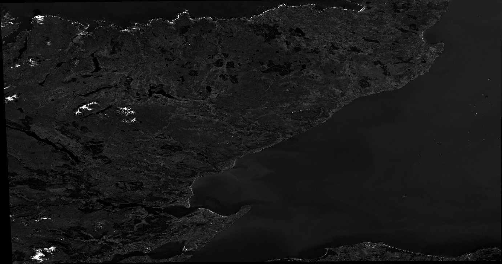
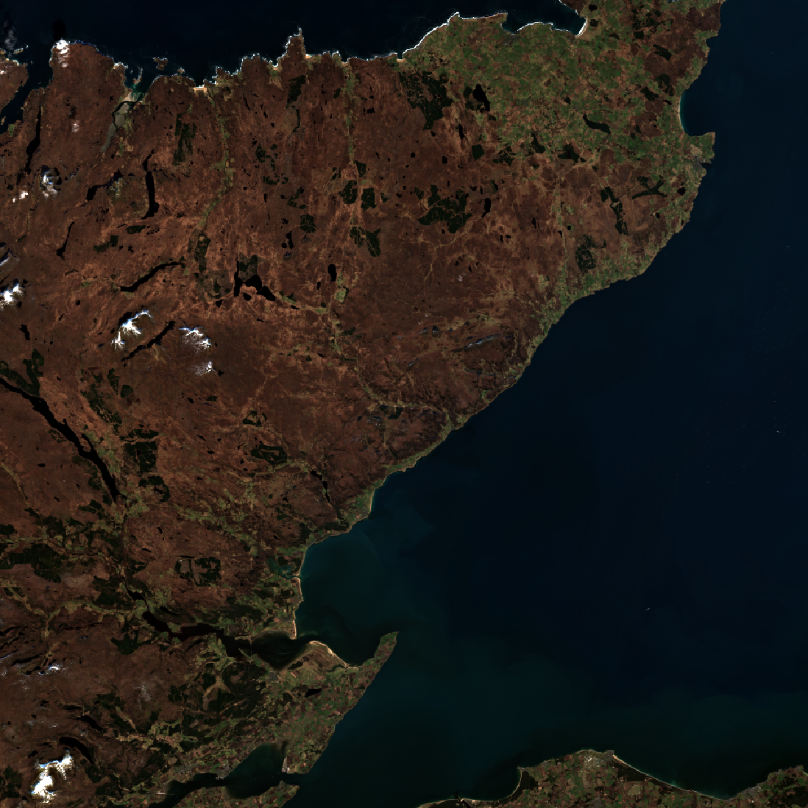

# EOPF / GeoZarr Validation Report (Bash)

> **8/8 tasks passed** &nbsp;·&nbsp; Generated: 2026-03-31T11:14:34Z

## 1. Environment

| Key | Value |
|-----|-------|
| GDAL version | `GDAL 3.13.0dev-2044425c73a079babe690537c692b57482e8d32c, released 2026/03/26` |
| Platform | `Linux 6.12.54-linuxkit aarch64` |
| Dataset URL | `https://s3.explorer.eopf.copernicus.eu/esa-zarr-sentinel-explorer-fra/tests-output/sentinel-2-l2a/S2B_MSIL2A_20260228T114349_N0512_R123_T30VVK_20260228T155602.zarr` |
| Date | `2026-03-31T11:14:34Z` |

## 2. Test Results

| Task | Status | Duration | Network | Details |
|------|--------|----------|---------|----------|
| 1. Metadata | ✅ PASS | 2.61s | — | CRS=EPSG:32630 overviews=5>=3 block=244x244 |
| 2. Partial Read | ✅ PASS | 3.01s | 573 KB | 244x244 window read 573 KB (< 1024 KB limit) |
| 3. Export -> GeoTIFF | ✅ PASS | 25.56s | — | Exported to band.tif, CRS=EPSG:32630 verified |
| 4. Reproject -> 4326 | ✅ PASS | 26.40s | — | Reprojected to EPSG:4326, output=b02_4326.tif thumbnail max pixel=255/255 |
| 5. RGB Composite | ✅ PASS | 106.25s | — | RGB PNG written (1319 KB, max pixel=255/255): rgb_composite_bash.png |
| 6. Overview Read | ✅ PASS | 11.06s | 87682 KB | 5 overview levels; coarsest: 117768 KB; network: 87682 KB |
| 7. Resolutions | ✅ PASS | 7.18s | — | r10m=10m(ok) r20m=20m(ok) r60m=60m(ok) |
| 8. GeoZarr Conventions | ✅ PASS | 2.50s | — | driver=Zarr CRS=present GeoTransform=non-default |

### 1. Metadata

**Status:** ✅ PASS &nbsp;·&nbsp; **Duration:** 2.61s

CRS=EPSG:32630 overviews=5>=3 block=244x244

**Reference CLI commands** (copy-paste to replicate):

```bash
gdalinfo 'ZARR:"/vsicurl/https://s3.explorer.eopf.copernicus.eu/esa-zarr-sentinel-explorer-fra/tests-output/sentinel-2-l2a/S2B_MSIL2A_20260228T114349_N0512_R123_T30VVK_20260228T155602.zarr":/measurements/reflectance/r10m/b02'
```

<details>
<summary>Command output</summary>

```
Driver: Zarr/Zarr
Files: /vsicurl/https://s3.explorer.eopf.copernicus.eu/esa-zarr-sentinel-explorer-fra/tests-output/sentinel-2-l2a/S2B_MSIL2A_20260228T114349_N0512_R123_T30VVK_20260228T155602.zarr/measurements/reflectance/r10m/b02/zarr.json
Size is 10980, 10980
Coordinate System is:
PROJCRS["WGS 84 / UTM zone 30N",
    BASEGEOGCRS["WGS 84",
        ENSEMBLE["World Geodetic System 1984 ensemble",
            MEMBER["World Geodetic System 1984 (Transit)"],
            MEMBER["World Geodetic System 1984 (G730)"],
            MEMBER["World Geodetic System 1984 (G873)"],
            MEMBER["World Geodetic System 1984 (G1150)"],
            MEMBER["World Geodetic System 1984 (G1674)"],
            MEMBER["World Geodetic System 1984 (G1762)"],
            MEMBER["World Geodetic System 1984 (G2139)"],
            MEMBER["World Geodetic System 1984 (G2296)"],
            ELLIPSOID["WGS 84",6378137,298.257223563,
                LENGTHUNIT["metre",1]],
            ENSEMBLEACCURACY[2.0]],
        PRIMEM["Greenwich",0,
            ANGLEUNIT["degree",0.0174532925199433]],
```
</details>

### 2. Partial Read

**Status:** ✅ PASS &nbsp;·&nbsp; **Duration:** 3.01s

244x244 window read 573 KB (< 1024 KB limit)

**Reference CLI commands** (copy-paste to replicate):

```bash
CPL_VSIL_SHOW_NETWORK_STATS=YES \
  gdal_translate 'ZARR:"/vsicurl/https://s3.explorer.eopf.copernicus.eu/esa-zarr-sentinel-explorer-fra/tests-output/sentinel-2-l2a/S2B_MSIL2A_20260228T114349_N0512_R123_T30VVK_20260228T155602.zarr":/measurements/reflectance/r10m/b02' out_partial.tif \
  -srcwin 0 0 244 244 -q
```

<details>
<summary>Command output</summary>

```
Network statistics:
{
  "methods":{
    "HEAD":{
      "count":9
    },
    "GET":{
      "count":5,
      "downloaded_bytes":587204
    }
  },
  "handlers":{
    "vsicurl":{
      "methods":{
        "HEAD":{
          "count":9
        },
        "GET":{
          "count":5,
          "downloaded_bytes":587204
```
</details>

### 3. Export -> GeoTIFF

**Status:** ✅ PASS &nbsp;·&nbsp; **Duration:** 25.56s

Exported to band.tif, CRS=EPSG:32630 verified

**Reference CLI commands** (copy-paste to replicate):

```bash
gdal_translate 'ZARR:"/vsicurl/https://s3.explorer.eopf.copernicus.eu/esa-zarr-sentinel-explorer-fra/tests-output/sentinel-2-l2a/S2B_MSIL2A_20260228T114349_N0512_R123_T30VVK_20260228T155602.zarr":/measurements/reflectance/r10m/b02' band.tif -q
gdalinfo band.tif
```

<details>
<summary>Command output</summary>

```
Driver: GTiff/GeoTIFF
Files: output/band.tif
Size is 10980, 10980
Coordinate System is:
PROJCRS["WGS 84 / UTM zone 30N",
    BASEGEOGCRS["WGS 84",
        DATUM["World Geodetic System 1984",
            ELLIPSOID["WGS 84",6378137,298.257223563,
                LENGTHUNIT["metre",1]]],
        PRIMEM["Greenwich",0,
            ANGLEUNIT["degree",0.0174532925199433]],
        ID["EPSG",4326]],
    CONVERSION["UTM zone 30N",
        METHOD["Transverse Mercator",
            ID["EPSG",9807]],
        PARAMETER["Latitude of natural origin",0,
            ANGLEUNIT["degree",0.0174532925199433],
            ID["EPSG",8801]],
        PARAMETER["Longitude of natural origin",-3,
            ANGLEUNIT["degree",0.0174532925199433],
```
</details>

### 4. Reproject -> 4326

**Status:** ✅ PASS &nbsp;·&nbsp; **Duration:** 26.40s

Reprojected to EPSG:4326, output=b02_4326.tif thumbnail max pixel=255/255

**Reference CLI commands** (copy-paste to replicate):

```bash
gdalwarp -t_srs EPSG:4326 'ZARR:"/vsicurl/https://s3.explorer.eopf.copernicus.eu/esa-zarr-sentinel-explorer-fra/tests-output/sentinel-2-l2a/S2B_MSIL2A_20260228T114349_N0512_R123_T30VVK_20260228T155602.zarr":/measurements/reflectance/r10m/b02' b02_4326.tif -q
gdal_translate -of PNG -scale 0.0 0.3 0 255 -outsize 10% 10% b02_4326.tif b02_4326.png -q
```

<details>
<summary>Command output</summary>

```
Driver: GTiff/GeoTIFF
Files: output/b02_4326.tif
Size is 13829, 7293
Coordinate System is:
GEOGCRS["WGS 84",
    ENSEMBLE["World Geodetic System 1984 ensemble",
        MEMBER["World Geodetic System 1984 (Transit)"],
        MEMBER["World Geodetic System 1984 (G730)"],
        MEMBER["World Geodetic System 1984 (G873)"],
        MEMBER["World Geodetic System 1984 (G1150)"],
        MEMBER["World Geodetic System 1984 (G1674)"],
        MEMBER["World Geodetic System 1984 (G1762)"],
        MEMBER["World Geodetic System 1984 (G2139)"],
        MEMBER["World Geodetic System 1984 (G2296)"],
        ELLIPSOID["WGS 84",6378137,298.257223563,
            LENGTHUNIT["metre",1]],
        ENSEMBLEACCURACY[2.0]],
    PRIMEM["Greenwich",0,
        ANGLEUNIT["degree",0.0174532925199433]],
    CS[ellipsoidal,2],
```
</details>

### 5. RGB Composite

**Status:** ✅ PASS &nbsp;·&nbsp; **Duration:** 106.25s

RGB PNG written (1319 KB, max pixel=255/255): rgb_composite_bash.png

**Reference CLI commands** (copy-paste to replicate):

```bash
gdalbuildvrt -separate rgb.vrt \
  'ZARR:"/vsicurl/https://s3.explorer.eopf.copernicus.eu/esa-zarr-sentinel-explorer-fra/tests-output/sentinel-2-l2a/S2B_MSIL2A_20260228T114349_N0512_R123_T30VVK_20260228T155602.zarr":/measurements/reflectance/r10m/b04' \
  'ZARR:"/vsicurl/https://s3.explorer.eopf.copernicus.eu/esa-zarr-sentinel-explorer-fra/tests-output/sentinel-2-l2a/S2B_MSIL2A_20260228T114349_N0512_R123_T30VVK_20260228T155602.zarr":/measurements/reflectance/r10m/b03' \
  'ZARR:"/vsicurl/https://s3.explorer.eopf.copernicus.eu/esa-zarr-sentinel-explorer-fra/tests-output/sentinel-2-l2a/S2B_MSIL2A_20260228T114349_N0512_R123_T30VVK_20260228T155602.zarr":/measurements/reflectance/r10m/b02'
gdal_translate -of PNG -scale 0.0 0.3 0 255 -outsize 10% 10% rgb.vrt rgb_composite_bash.png -q
```

### 6. Overview Read

**Status:** ✅ PASS &nbsp;·&nbsp; **Duration:** 11.06s

5 overview levels; coarsest: 117768 KB; network: 87682 KB

**Reference CLI commands** (copy-paste to replicate):

```bash
gdalinfo 'ZARR:"/vsicurl/https://s3.explorer.eopf.copernicus.eu/esa-zarr-sentinel-explorer-fra/tests-output/sentinel-2-l2a/S2B_MSIL2A_20260228T114349_N0512_R123_T30VVK_20260228T155602.zarr":/measurements/reflectance/r10m/b02'
CPL_VSIL_SHOW_NETWORK_STATS=YES \
  gdal_translate 'ZARR:"/vsicurl/https://s3.explorer.eopf.copernicus.eu/esa-zarr-sentinel-explorer-fra/tests-output/sentinel-2-l2a/S2B_MSIL2A_20260228T114349_N0512_R123_T30VVK_20260228T155602.zarr":/measurements/reflectance/r10m/b02' overview.tif -ovr 0 -q
```

<details>
<summary>Command output</summary>

```
Driver: Zarr/Zarr
Files: /vsicurl/https://s3.explorer.eopf.copernicus.eu/esa-zarr-sentinel-explorer-fra/tests-output/sentinel-2-l2a/S2B_MSIL2A_20260228T114349_N0512_R123_T30VVK_20260228T155602.zarr/measurements/reflectance/r10m/b02/zarr.json
Size is 10980, 10980
Coordinate System is:
PROJCRS["WGS 84 / UTM zone 30N",
    BASEGEOGCRS["WGS 84",
        ENSEMBLE["World Geodetic System 1984 ensemble",
            MEMBER["World Geodetic System 1984 (Transit)"],
            MEMBER["World Geodetic System 1984 (G730)"],
            MEMBER["World Geodetic System 1984 (G873)"],
            MEMBER["World Geodetic System 1984 (G1150)"],
            MEMBER["World Geodetic System 1984 (G1674)"],
            MEMBER["World Geodetic System 1984 (G1762)"],
            MEMBER["World Geodetic System 1984 (G2139)"],
            MEMBER["World Geodetic System 1984 (G2296)"],
            ELLIPSOID["WGS 84",6378137,298.257223563,
                LENGTHUNIT["metre",1]],
            ENSEMBLEACCURACY[2.0]],
        PRIMEM["Greenwich",0,
            ANGLEUNIT["degree",0.0174532925199433]],
```
</details>

### 7. Resolutions

**Status:** ✅ PASS &nbsp;·&nbsp; **Duration:** 7.18s

r10m=10m(ok) r20m=20m(ok) r60m=60m(ok)

**Reference CLI commands** (copy-paste to replicate):

```bash
gdalinfo 'ZARR:"/vsicurl/https://s3.explorer.eopf.copernicus.eu/esa-zarr-sentinel-explorer-fra/tests-output/sentinel-2-l2a/S2B_MSIL2A_20260228T114349_N0512_R123_T30VVK_20260228T155602.zarr":/measurements/reflectance/r10m/b02'
gdalinfo 'ZARR:"/vsicurl/https://s3.explorer.eopf.copernicus.eu/esa-zarr-sentinel-explorer-fra/tests-output/sentinel-2-l2a/S2B_MSIL2A_20260228T114349_N0512_R123_T30VVK_20260228T155602.zarr":/measurements/reflectance/r20m/b05'
gdalinfo 'ZARR:"/vsicurl/https://s3.explorer.eopf.copernicus.eu/esa-zarr-sentinel-explorer-fra/tests-output/sentinel-2-l2a/S2B_MSIL2A_20260228T114349_N0512_R123_T30VVK_20260228T155602.zarr":/measurements/reflectance/r60m/b01'
```

<details>
<summary>Command output</summary>

```
Driver: Zarr/Zarr
Files: /vsicurl/https://s3.explorer.eopf.copernicus.eu/esa-zarr-sentinel-explorer-fra/tests-output/sentinel-2-l2a/S2B_MSIL2A_20260228T114349_N0512_R123_T30VVK_20260228T155602.zarr/measurements/reflectance/r60m/b01/zarr.json
Size is 1830, 1830
Coordinate System is:
PROJCRS["WGS 84 / UTM zone 30N",
    BASEGEOGCRS["WGS 84",
        ENSEMBLE["World Geodetic System 1984 ensemble",
            MEMBER["World Geodetic System 1984 (Transit)"],
            MEMBER["World Geodetic System 1984 (G730)"],
            MEMBER["World Geodetic System 1984 (G873)"],
            MEMBER["World Geodetic System 1984 (G1150)"],
            MEMBER["World Geodetic System 1984 (G1674)"],
            MEMBER["World Geodetic System 1984 (G1762)"],
            MEMBER["World Geodetic System 1984 (G2139)"],
            MEMBER["World Geodetic System 1984 (G2296)"],
            ELLIPSOID["WGS 84",6378137,298.257223563,
                LENGTHUNIT["metre",1]],
            ENSEMBLEACCURACY[2.0]],
        PRIMEM["Greenwich",0,
            ANGLEUNIT["degree",0.0174532925199433]],
```
</details>

### 8. GeoZarr Conventions

**Status:** ✅ PASS &nbsp;·&nbsp; **Duration:** 2.50s

driver=Zarr CRS=present GeoTransform=non-default

**Reference CLI commands** (copy-paste to replicate):

```bash
gdalinfo -json 'ZARR:"/vsicurl/https://s3.explorer.eopf.copernicus.eu/esa-zarr-sentinel-explorer-fra/tests-output/sentinel-2-l2a/S2B_MSIL2A_20260228T114349_N0512_R123_T30VVK_20260228T155602.zarr":/measurements/reflectance/r10m/b02'
```

<details>
<summary>Command output</summary>

```
{
  "description":"ZARR:\"/vsicurl/https://s3.explorer.eopf.copernicus.eu/esa-zarr-sentinel-explorer-fra/tests-output/sentinel-2-l2a/S2B_MSIL2A_20260228T114349_N0512_R123_T30VVK_20260228T155602.zarr\":/measurements/reflectance/r10m/b02",
  "driverShortName":"Zarr",
  "driverLongName":"Zarr",
  "files":[
    "/vsicurl/https://s3.explorer.eopf.copernicus.eu/esa-zarr-sentinel-explorer-fra/tests-output/sentinel-2-l2a/S2B_MSIL2A_20260228T114349_N0512_R123_T30VVK_20260228T155602.zarr/measurements/reflectance/r10m/b02/zarr.json"
  ],
  "size":[
    10980,
    10980
  ],
  "coordinateSystem":{
    "wkt":"PROJCRS[\"WGS 84 / UTM zone 30N\",\n    BASEGEOGCRS[\"WGS 84\",\n        ENSEMBLE[\"World Geodetic System 1984 ensemble\",\n            MEMBER[\"World Geodetic System 1984 (Transit)\"],\n            MEMBER[\"World Geodetic System 1984 (G730)\"],\n            MEMBER[\"World Geodetic System 1984 (G873)\"],\n            MEMBER[\"World Geodetic System 1984 (G1150)\"],\n            MEMBER[\"World Geodetic System 1984 (G1674)\"],\n            MEMBER[\"World Geodetic System 1984 (G1762)\"],\n            MEMBER[\"World Geodetic System 1984 (G2139)\"],\n            MEMBER[\"World Geodetic System 1984 (G2296)\"],\n            ELLIPSOID[\"WGS 84\",6378137,298.257223563,\n                LENGTHUNIT[\"metre\",1]],\n            ENSEMBLEACCURACY[2.0]],\n        PRIMEM[\"Greenwich\",0,\n            ANGLEUNIT[\"degree\",0.0174532925199433]],\n        ID[\"EPSG\",4326]],\n    CONVERSION[\"UTM zone 30N\",\n        METHOD[\"Transverse Mercator\",\n            ID[\"EPSG\",9807]],\n        PARAMETER[\"Latitude of natural origin\",0,\n            ANGLEUNIT[\"degree\",0.0174532925199433],\n            ID[\"EPSG\",8801]],\n        PARAMETER[\"Longitude of natural origin\",-3,\n            ANGLEUNIT[\"degree\",0.0174532925199433],\n            ID[\"EPSG\",8802]],\n        PARAMETER[\"Scale factor at natural origin\",0.9996,\n            SCALEUNIT[\"unity\",1],\n            ID[\"EPSG\",8805]],\n     
```
</details>

## 3. Screenshots / Images

### 4. Reproject -> 4326



### 5. RGB Composite



## 4. Network Efficiency

Summary of remote read performance measured with `CPL_VSIL_SHOW_NETWORK_STATS=YES`.

| Task | Downloaded | Budget | Result |
|------|-----------|--------|--------|
| 2. Partial Read | 573 KB | 1024 KB | ✅ within budget |
| 6. Overview Read | 87682 KB | — | ✅ within budget |

**Total measured network traffic across timed tests: 88255 KB**

The partial-read test confirms that reading a single Zarr shard (one chunk window) downloads only the bytes needed for that chunk, demonstrating efficient range-request support in the GDAL Zarr driver.

## 5. Issues Found

No issues found. All tasks passed without errors.

## 6. Conclusion

All **8 contracted validation tasks** passed successfully against
https://s3.explorer.eopf.copernicus.eu/esa-zarr-sentinel-explorer-fra/tests-output/sentinel-2-l2a/S2B_MSIL2A_20260228T114349_N0512_R123_T30VVK_20260228T155602.zarr using GDAL 3.13.0dev-2044425c73a079babe690537c692b57482e8d32c, released 2026/03/26.

The following capabilities are confirmed working:

- **1. Metadata**: CRS=EPSG:32630 overviews=5>=3 block=244x244
- **2. Partial Read**: 244x244 window read 573 KB (< 1024 KB limit)
- **3. Export -> GeoTIFF**: Exported to band.tif, CRS=EPSG:32630 verified
- **4. Reproject -> 4326**: Reprojected to EPSG:4326, output=b02_4326.tif thumbnail max pixel=255/255
- **5. RGB Composite**: RGB PNG written (1319 KB, max pixel=255/255): rgb_composite_bash.png
- **6. Overview Read**: 5 overview levels; coarsest: 117768 KB; network: 87682 KB
- **7. Resolutions**: r10m=10m(ok) r20m=20m(ok) r60m=60m(ok)
- **8. GeoZarr Conventions**: driver=Zarr CRS=present GeoTransform=non-default

The GDAL Zarr driver correctly reads EOPF CPM Zarr datasets over
`/vsicurl`, exposes CRS and overview metadata, supports partial
(shard-aligned) reads with efficient network usage, exports to
GeoTIFF, reprojects via `gdalwarp`, renders RGB composites, reads
all configured resolution bands, and reports GeoZarr-compliant
driver/CRS/GeoTransform metadata. **The contracted scope is delivered
and working.**

